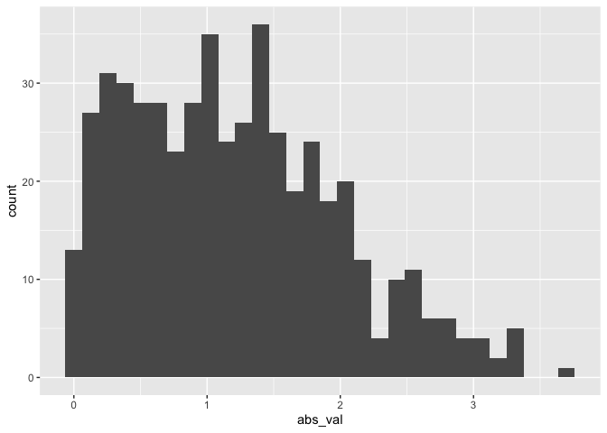

Simple document
================
Mengfan Luo
2021-9-16

Put libraries at the top.

``` r
library(tidyverse)
```

I’m an R Markdown document!

# Section 1

Here’s a **code chunk** that samples from a *normal distribution*:

``` r
samp = rnorm(100)
length(samp)
```

    ## [1] 100

# Section 2

I can take the mean of the sample, too! The mean is -0.078565.

# Section 3

Write a new code chunk

The code chunk import the ‘tidyverse’,create a dataframe, and makes a
histogram.

inside the chunk name can have options including:
echo=FALSE,collapse=TRUE,message=FALSE

``` r
#library(tidyverse)

set.seed(1234)

plot_df = 
  tibble(
    x = rnorm(1000, sd = .5),
    y = 1 + 2 * x + rnorm(1000),
    y_quad = 1 + 2 * x^2 + rnorm(1000)
  )
plot_df
```

    ## # A tibble: 1,000 x 3
    ##         x      y  y_quad
    ##     <dbl>  <dbl>   <dbl>
    ##  1 -0.604 -1.41   0.755 
    ##  2  0.139  1.58   0.939 
    ##  3  0.542  0.545  1.48  
    ##  4 -1.17  -0.710  4.94  
    ##  5  0.215  2.13  -0.564 
    ##  6  0.253 -0.400  0.0824
    ##  7 -0.287  1.36  -0.575 
    ##  8 -0.273  0.229  1.66  
    ##  9 -0.282 -0.238  0.713 
    ## 10 -0.445  0.556 -0.443 
    ## # ... with 990 more rows

``` r
ggplot(plot_df,aes(x = x)) + geom_histogram()
```

    ## `stat_bin()` using `bins = 30`. Pick better value with `binwidth`.

<!-- -->

# Learning assessment:

Write a named code chunk that creates a dataframe comprised of: a
numeric variable containing a random sample of size 500 from a normal
variable with mean 1; a logical vector indicating whether each sampled
value is greater than zero; and a numeric vector containing the absolute
value of each element. Then, produce a histogram of the absolute value
variable just created. Add an inline summary giving the median value
rounded to two decimal places. What happens if you set eval = FALSE to
the code chunk? What about echo = FALSE

``` r
learning_df = 
  tibble(
    sample = rnorm(500, mean = 1),
    vec_logic = sample > 0,
    abs_val = abs(sample)
  )

ggplot(learning_df,aes(x = abs_val)) + geom_histogram()
```

    ## `stat_bin()` using `bins = 30`. Pick better value with `binwidth`.

<!-- -->

## Tables

| First Header | Second Header |
|--------------|---------------|
| Content Cell | Content Cell  |
| Content Cell | Content Cell  |
